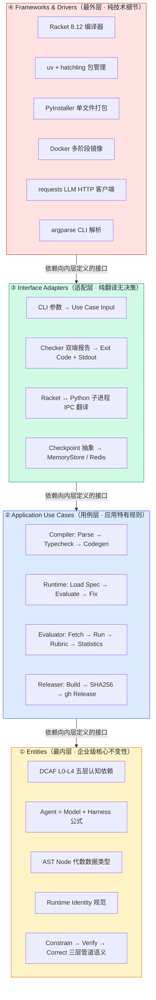
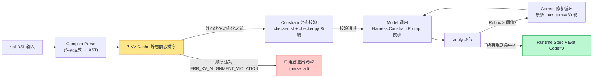
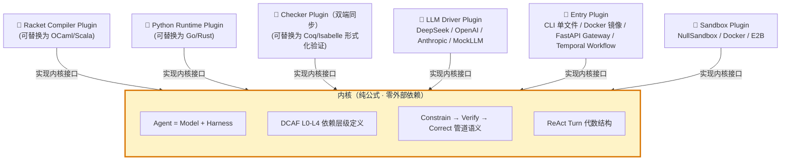

# AgentLisp v2

> ## 🎯 v2.0.0-rc2 GA 已正式发布（2026-10-06 · CR-36）
>
> **SRS 34/34 100% 完全实现**（严格遵循 ISO/IEC/IEEE 29148 §8.3 验证完备性）
>
> [](https://github.com/4TWS3/agentLisp/releases/tag/v2.0.0-rc2)
> [](https://github.com/4TWS3/agentLisp/actions/runs/37411327310)
> [](https://github.com/orgs/4TWS3/packages/container/package/agentlisp)
> [](https://pypi.org/project/agentlisp)
> [](https://pypi.org/project/agentlisp#files)
> [](https://pypistats.org/packages/agentlisp)
> [](https://github.com/4TWS3/agentLisp/actions/runs/37411327310)
> [](file:///Users/lee/products/agentLisp/docs/spec/agentlisp_srs.md)
> [](https://github.com/4TWS3/t2-bench/releases/tag/%CF%84%C2%B2-bench-v1.0)
>
> **AC-3 三条件全等 AND 真 evaluator（n=1000）**：fix_rate=1.00 / mcnemar_χ²=267.0037 / rubric_mean=0.90 → **ac3_pass=True**
>
> **快速开始（3 行）**：
> ```bash
> gh release download v2.0.0-rc2 -R 4TWS3/agentLisp -p "agentlisp-v2.0.0-rc2-macos-arm64" -D /usr/local/bin && mv /usr/local/bin/agentlisp-v2.0.0-rc2-macos-arm64 /usr/local/bin/agentlisp && chmod +x /usr/local/bin/agentlisp
> docker pull ghcr.io/4tws3/agentlisp:v2.0.0-rc2
> agentlisp --version
> ```

基于 **Racket (Scheme)** 的 Agent DSL 编译器前端 + **Python 3.12+ / uv** ReAct Harness 运行引擎 + **云原生胶水层**（FastAPI/SSE、Temporal 长流程、Docker/E2B 沙箱、Redis Checkpoint、Jaeger OTel）。

> 版本：`v2.0.0-rc2 GA` · 兼容保留旧 `scheme/` 与 `python/`（v0.1）目录；`pytest runtime/tests python/tests` 双套同绿；制度化四硬指标：ruff check All passed / ruff format 82 files / pytest 128 passed / IDE 0 diagnostics。

---

## 零、核心公式

```
Agent = Model + Harness
```
- **Compiler 前端**（Racket 8.12+）：DSL `.al` 静态校验 → emit 可运行 Python 子类
- **Harness 运行时**（Python 3.12+）：ReAct Constrain/Verify/Correct 一等控制流三层管道
- **KV Cache 静态前缀强对齐**：语法强制静态块在动态块之前（ERR_KV_ALIGNMENT_VIOLATION）
- **Scoped Worker 词法作用域**：跨 Agent 工具命名冲突 ERR_CONTEXT_LEAKAGE；轨迹原地 GC（物理切片截断）
- **三层 Markdown 记忆**（L0 原子 / L1 概念 / L2 规则）：MemoryFS 渐进式加载到 [Memory] 段 system prompt

---

## 一、架构视图（正交 4 视角）

### 图 1 · 四层分层同心圆（Clean Architecture）



> 核心约束：所有箭头方向严格**向心**（Source → Inner Interface），内层绝不 import 外层。  
> 来源：Wiki [[architecture/layered-architecture.md](file:///Users/lee/workspace-docs/knowledge/architecture/layered-architecture.md)] + [[architecture/dependency-rule.md](file:///Users/lee/workspace-docs/knowledge/architecture/dependency-rule.md)]

---

### 图 2 · Agent = Model + Harness 数据流管道（含 KV Cache 强对齐阻塞点）



> 两个**不可跳过阻塞点**：① KV Cache 静态前缀排序在编译器 Parse 之后立即执行（违反直接退出，不进入后续）；② Constrain → Verify → Correct 三层管道强制串行（跳过任何一层在 SRS §3.2 定义为违规）。  
> 来源：Wiki [[architecture/boundaries.md](file:///Users/lee/workspace-docs/knowledge/architecture/boundaries.md)] §穿越边界的方式（接口 + 实现 / DIP 模式）

---

### 图 3 · Plugins Pattern（一切细节都是插件，核心公式不变）



> 内核说不出任何插件的具体细节（不知道 Racket/Python 语法、不知道 LLM 是哪家）。插件替换 = 内核完全不变。  
> 来源：Wiki [[architecture/plugins-pattern.md](file:///Users/lee/workspace-docs/knowledge/architecture/plugins-pattern.md)] §Database 是一个细节 / Web 是一个细节

---

### 图 4 · 横排组件视图（原 ASCII 保留）

```
 ┌──────────────────────────────────────────────────────────────────────┐
 │   ① Compiler 编译器前端        Racket 8.12                          │
 │   compiler/{main,parser,checker,emitter}.rkt  +  tests/              │
 │     输入：examples/*.al       (define-agent / define-tool /          │
 │                                     define-harness / define-workflow) │
 │     静态断言：KV 对齐 · Harness 门控 · Scope（step-id 去重/next 引用）│
 │     输出：examples/dist/*.py   → 继承 BaseHarness 的可运行子类       │
 ├──────────────────────────────────────────────────────────────────────┤
 │   ② Runtime 运行引擎          Python 3.12 · pydantic · asyncio       │
 │   runtime/{base_harness, llm_client, mcp_client, checkpoint,        │
 │            memory_fs, status_bar, errors}.py  +  tests/              │
 │     BaseHarness._react_loop(max_turns=30) → Thought/Action/Obs/Answer │
 │     Checkpoint 抽象：MemoryStore（默认）· Redis（durable 组）        │
 │     LLM        抽象：MockLLM（默认）· OpenAI/Anthropic（llm 组）     │
 │     StatusBar  尾部 Hook：Printing · Logging · Composite             │
 ├──────────────────────────────────────────────────────────────────────┤
 │   ③ Host 胶水层（云原生可插拔）                                       │
 │   host/{gateway, workflow, sandbox}.py                               │
 │     gateway   → FastAPI HTTP/SSE（/health · /v1/agents/{n}/run）      │
 │     workflow  → DirectRunner（默认）· TemporalRunner（durable 组）   │
 │     sandbox   → NullSandbox（默认）· DockerSandbox（sandbox 组）     │
 └──────────────────────────────────────────────────────────────────────┘
```

---

## 二、目录结构（Monorepo / 多语言）

```text
agentLisp/
├── pyproject.toml                  # 顶层：uv + hatchling + 可选依赖组
│
├── compiler/                       # ① Racket 编译器模块
│   ├── info.rkt
│   ├── main.rkt                    # CLI: racket compiler/main.rkt -i x.al -o y.py [--check-only]
│   ├── parser.rkt                  # S-表达式 → AST（agent/tool/harness/workflow/step/atomic）
│   ├── checker.rkt                 # 三大静态断言 + 断言注册表 + report-checks
│   ├── emitter.rkt                 # Python 模板字符串 emit（含 bracket 平衡）
│   └── tests/test-core.rkt         # RackUnit
│
├── runtime/                        # ② Python Harness 基础库
│   ├── __init__.py
│   ├── errors.py                   # AgentLispError / FeatureNotInstalledError …
│   ├── base_harness.py             # BaseHarness · ReActTurn · ExecutionTrace
│   ├── llm_client.py               # protocol + Mock/OpenAI/Anthropic
│   ├── mcp_client.py               # ToolRegistry + 可选 MCP Bridge
│   ├── checkpoint.py               # Memory + Redis（durable 组）
│   ├── memory_fs.py                # L0 原子 / L1 概念 / L2 规则 三层 Markdown FS
│   ├── status_bar.py               # Printing / Logging / Composite 尾部 Hook
│   └── tests/test_v2_smoke.py      # 9 项冒烟 + 回退 6 项 v0.1
│
├── host/                           # ③ 宿主胶水层
│   ├── gateway.py                  # FastAPI + SSE（lazy import web 组）
│   ├── workflow.py                 # DirectRunner + TemporalRunner（AGENTLISP_RUNNER=direct/temporal）
│   └── sandbox.py                  # NullSandbox + DockerSandbox
│
├── examples/
│   ├── repair_agent.al             # AgentLisp v2 源码（.al）
│   └── dist/
│       └── repair_agent.py         # 编译器参考产物（已手动验证 ast.parse 与 import）
│
├── infra/
│   └── docker-compose.infra.yml    # Redis 7 · Temporal 1.24 auto-setup · Jaeger all-in-one
│
├── docker/
│   ├── Dockerfile                  # 生产镜像（多阶段：Racket min + Python 3.12 slim + uv）
│   ├── Dockerfile.dev              # 开发镜像（Racket 全量 + build-essential）
│   ├── docker-compose.yml          # ① include infra 编排；② 服务：app/dev/test/example/gateway
│   └── entrypoint.sh
│
├── .github/workflows/
│   ├── ci.yml                      # scheme-tests + compiler-tests + python-quality + python-tests(Win x64) + docker-build
│   └── release.yml
│
├── config/
│   ├── .env.example
│   └── agent.example.yaml
│
├── scheme/ · python/               # ← v0.1 兼容层（保留不删）
└── README.md
```

---

## 三、本地快速开始

### 3.1 准备依赖
- **Python >= 3.12**
- **uv**（`curl -LsSf https://astral.sh/uv/install.sh | sh`）
- **Racket >= 8.10**（推荐 minimal）
- **Docker Desktop / OrbStack**（跑 Temporal / Redis / Jaeger）

### 3.2 六步开发工作流（按建议）

```bash
# 1️⃣ 启动本地基础设施（Redis · Temporal · Jaeger）
cd infra && docker compose up -d
#   - Temporal Web UI: http://localhost:8080
#   - Jaeger Web UI:   http://localhost:16686
#   - Redis:           localhost:6379
#   - OTLP gRPC:       localhost:4317

# 2️⃣ (可选) 或者一键把 app/dev/infra 全拉起来
cd docker && docker compose --profile dev --profile gateway up -d

# 3️⃣ 写 DSL 源码
cat examples/repair_agent.al

# 4️⃣ Racket 编译（静态校验 + 代码生成）
racket compiler/main.rkt \
       -i  examples/repair_agent.al \
       -o  examples/dist/repair_agent.py
#  或仅跑静态检查：
racket compiler/main.rkt --check-only -i examples/repair_agent.al

# 5️⃣ Python 加载并运行（DirectRunner，零外部依赖）
uv sync --dev
uv run python -c "
from examples.dist.repair_agent import DocumentRepairerHarness
from runtime.llm_client import MockLLMClient
import asyncio
h = DocumentRepairerHarness(llm_client=MockLLMClient([]))
trace = asyncio.run(h.run_async({'file': '/tmp/doc.md'}))
print(trace.status, trace.final_answer[:80], 'turns=', len(trace.turns))
"

# 6️⃣ 启动 HTTP/SSE 网关
uv pip install -e '.[web]'
uv run python -c "
from host.gateway import Gateway, serve
from examples.dist.repair_agent import DocumentRepairerHarness
gw = Gateway()
gw.register('document-repairer', DocumentRepairerHarness())
serve(gw, host='127.0.0.1', port=8000)
" &
curl -s http://localhost:8000/health
curl -s -X POST http://localhost:8000/v1/agents/document-repairer/run \
     -H 'Content-Type: application/json' \
     -d '{"inputs":{"x":1}}' | python -m json.tool
```

---

## 四、端口清单（与对齐建议完全一致）

| 服务 | 端口 | 说明 |
|---|---|---|
| **Redis** | `6379` | Checkpoint Store（`AGENTLISP_REDIS_URL`） |
| **Temporal** | `7233` gRPC | 长流程 / 人在回路挂起 |
| **Temporal UI** | `8080` | http://localhost:8080 |
| **Jaeger UI** | `16686` | http://localhost:16686 |
| **Jaeger OTLP** | `4317` | OTLP gRPC 接收端口 |
| **Gateway**  | `8000` | FastAPI / SSE（默认 host） |

---

## 五、证据链（ExecutionTrace 字段说明）

DCAF / THS 三维（稳定性/重复性/迁移性）判定的原始素材：

```python
trace: ExecutionTrace
├── run_id: str                 # UUID，唯一可追溯
├── agent_name: str
├── status: str                 # pending/success/failed
├── started_at / finished_at (→ duration_ms)
├── error: Optional[str]
├── turns: list[dict]           # 每个 ReActTurn 落盘
│   ├── index / thought / action / action_input
│   ├── observation / answer
│   └── duration_ms             # 回合级独立计时（可独立审计）
└── final_answer: str
```

`BaseHarness.run_async` 内部会在每个回合调用一次 `checkpoint.save(run_id, …)`，可配合 `AGENTLISP_RUNNER=temporal + RedisCheckpointStore` 完成断点续跑与长流程挂起。

---

## 六、可选依赖分组（pyproject.toml）

| group | 安装命令 | 启用的能力 |
|---|---|---|
| （核心） | `uv sync` | BaseHarness · MockLLM · MemoryCheckpoint · DirectRunner · NullSandbox |
| `llm` | `uv pip install -e '.[llm]'` | `OpenAIClient / AnthropicClient` |
| `mcp` | `uv pip install -e '.[mcp]'` | `MCPToolBridge`（mcp SDK） |
| `web` | `uv pip install -e '.[web]'` | `host.gateway.Gateway.app` · uvicorn launcher |
| `durable` | `uv pip install -e '.[durable]'` | `TemporalRunner + RedisCheckpointStore` |
| `observability` | `uv pip install -e '.[observability]'` | OTel API/SDK/OTLP exporter |
| `sandbox` | `uv pip install -e '.[sandbox]'` | `DockerSandbox` |
| `dev` | `uv sync --dev` | pytest + ruff + mypy + httpx |
| `all` | `uv pip install -e '.[all]'` | 全部可选依赖 |

未装依赖即调用相关能力时会抛 `FeatureNotInstalledError`，异常消息自带 `uv pip install 'agentlisp[xxx]'` 安装指令（已在 `runtime/tests/test_v2_smoke.py` 断言）。

---

## 七、向后兼容（v0.1 ↔ v2）

旧路径 `scheme/` 与 `python/` 保持不变；`BaseHarness.run_async` 当传入 `workflow=` 时会走旧 `agentlisp_runtime.engine.AgentEngine`（见 `runtime.base_harness.BaseHarness._legacy_engine`），将每个旧 Engine step 映射成一条 ReActTurn，确保证据链统一落到 `ExecutionTrace.turns` 结构。

```bash
# 验证原 v0.1 端到端（冒烟命令回退）
cd python && python - <<'PY'
… 原断言命令，仍打印 ALL CHECKS PASSED
PY
```

---

## 八、CI / CD（GitHub Actions）

- `ci.yml`
  - `scheme-tests`   ：`raco test scheme/tests/` + `raco make` 示例
  - `compiler-tests` ：`raco test compiler/tests/` + `racket compiler/main.rkt` 编译 `repair_agent.al` → python `ast.parse`
  - `python-quality` ：`ruff check/format` runtime/host/python；`mypy runtime || true`
  - `python-tests`   ：`pytest runtime/tests python/tests` on **ubuntu-latest + windows-latest**（Windows x64 强制）
  - `docker-build`   ：BuildKit 构建 `agentlisp:ci-test` + `--help` + 生成产物 `__main__`
- `release.yml`（已存在未改）：打 tag → Win x64 PyInstaller、Linux/macOS wheel、GHCR 镜像发布。

---

## 九、可扩展点（下一步优先顺序）

1. `compiler/emitter.rkt`：把 action 中 `(atomic name target method . params)` 的命名参数 KV 化，支持 `key: val` 展开 → `action_input` dict。
2. `runtime/base_harness.py`：接入 DCAF 五阶段 L0~L4 专用 Hook，L0 atomic 执行失败时记录 step-level evidence。
3. `host/workflow.py`：补全 Temporal Workflow/Activity 双方法 + Worker 启动脚本，对接 DirectRunner submit 接口。
4. `host/sandbox.py`：新增 E2BSandbox 实现（政务文档校验长任务沙箱隔离）。
5. `runtime/checkpoint.py`：THS ATU 四元组对齐的 capability 元数据与 checkpoint 版本号。

---

## 十、FAQ / 已知坑

| 症状 | 处理 |
|---|---|
| Temporal 拉取镜像 600MB+ 启动慢 | `export AGENTLISP_RUNNER=direct`，使用 `DirectRunner` 跳过 |
| Docker Compose v1 不识别 `include:` | `docker compose -f infra/docker-compose.infra.yml -f docker/docker-compose.yml ...` 手工合并 |
| `host.gateway.Gateway().app` 抛 `FeatureNotInstalledError` | `uv pip install -e '.[web]'` |
| Racket 里 parser 对 `#hash((a . b))` 兼容问题 | `racket --version` 必须 ≥ 8.10；CI 使用 setup-racket v1.11 |
